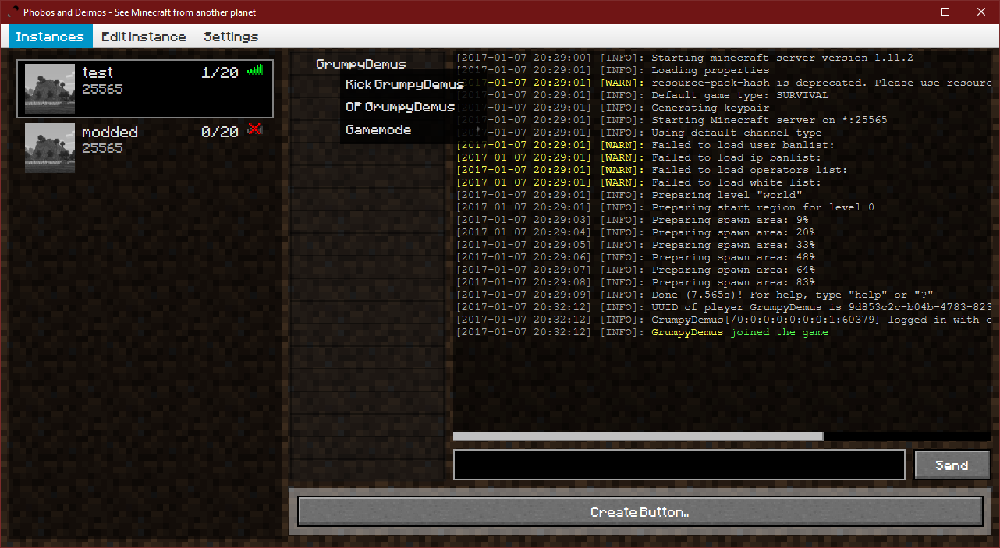

# Phobos and Deimos
A graphical user interface for advanced Minecraft server hosting 

Features
--------

* Managing multiple server instances at the same time
* completion on commands
* server.properties editor
* [Plugin API](/plugin_api.md "Plugin API") to add behaviour on certain events (eg. chat bots)
* Download of recent server.jar files
* Quickmanaging players (OP, Gamemode, Kick)
* Buttons for quickcommands
